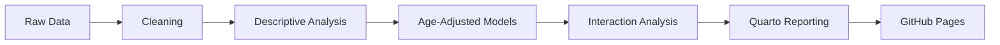

# Public Health Statistics Workflow
*A reproducible public-health analytics workflow project*

This project turns a compact public-health dataset into a reproducible descriptive epidemiology workflow. It demonstrates how to move from cleaned tabular data to sex-stratified summaries, age-adjusted regression models, exploratory interaction checks, and a Quarto reporting layer, while keeping raw data and generated outputs out of Git.

## What This Demonstrates

- Reproducible descriptive epidemiology workflow
- Public-health threshold analysis
- Age-adjusted regression modeling
- Forest plot visualization
- Exploratory subgroup interaction analysis
- Quarto reporting workflow
- Git and GitHub reproducibility practices

## Workflow



## Why This Project Matters

Public-health datasets are often first explored in spreadsheets, but the analysis becomes much more defensible when the workflow is scripted, versioned, and easy to rerun. This project shows that transition in a modest but practical form: descriptive comparisons are documented clearly, age adjustment is handled transparently, and the final report is presented through a reproducible Quarto layer.

The emphasis is interpretability. The results are framed as observational summaries, not causal claims, and the visuals are designed to make uncertainty and attenuation easy to see.

## Key Findings

- Crude sex differences are visible across several cardiometabolic and dietary indicators.
- Some differences attenuate after adjustment for categorical age group.
- Confidence intervals matter as much as point estimates in the forest plots.
- The interaction analysis is exploratory and highlights possible subgroup heterogeneity.

## Representative Results

These curated previews are intentionally tracked in `docs/figures/` for the README. The full-resolution analysis figures remain under ignored output paths.

### Figure 5. Age-Adjusted Mean Differences


*Age-adjusted mean differences for continuous outcomes.*

The forest plot summarizes how the Female vs Male contrasts behave after adjusting for categorical age group only. Estimates closer to zero suggest attenuation of the crude difference; wider intervals signal greater uncertainty.

### Figure 6. Age-Adjusted Odds Ratios


*Age-adjusted odds ratios for binary threshold outcomes.*

This figure translates the same sex comparison into public-health cutoff outcomes. It complements the continuous-outcome forest plot by showing whether threshold-based differences persist after age adjustment.

## Statistical Methods

- Descriptive statistics: means, standard deviations, medians, interquartile ranges, and percentages
- Mann-Whitney U tests for crude continuous comparisons
- Chi-square tests for crude categorical and binary comparisons
- Age-adjusted linear regression for continuous outcomes
- Age-adjusted logistic regression for binary cutoff outcomes
- Exploratory sex-by-age interaction models to assess possible subgroup heterogeneity

All inferential work is framed as descriptive or sensitivity analysis rather than causal inference.

## Reproducibility

- The Jupyter notebook is the main analysis workspace.
- Reusable helper functions live under `src/` for future refactoring.
- `reports/public_health_summary_report.qmd` is the presentation layer.
- Generated outputs live under `outputs/` and are intentionally ignored by Git.
- Curated README preview images are stored separately under `docs/figures/`.

## Explore The Project

- [Main Analysis Notebook](notebooks/generate_public_health_summary_table.ipynb)
- [Quarto Report Source](reports/public_health_summary_report.qmd)
- [Live Quarto Report](https://makotoy56.github.io/public-health-statistics-workflow/)

GitHub Pages must be enabled from repository Settings > Pages > Build and deployment > GitHub Actions.

## Repository Structure

```text
.
├── data/                     # local workbook, ignored
├── docs/
│   └── figures/
├── notebooks/
│   └── generate_public_health_summary_table.ipynb
├── outputs/                  # generated files, ignored
├── reports/
│   └── public_health_summary_report.qmd
├── src/
├── README.md
└── requirements.txt
```

## Notes on Data

Keep the local workbook under `data/` and out of Git. The repository is structured so the analysis can be rerun locally without tracking the underlying raw data or generated outputs.
