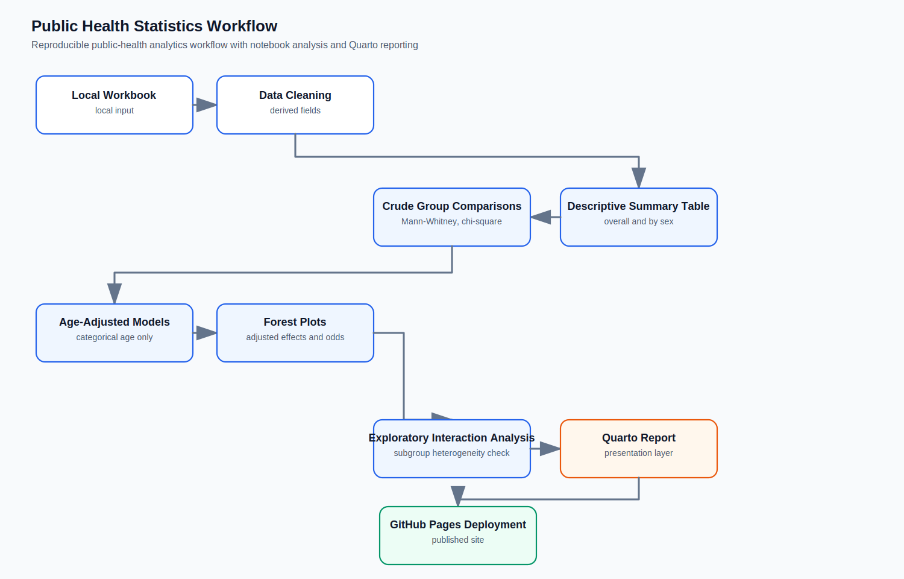
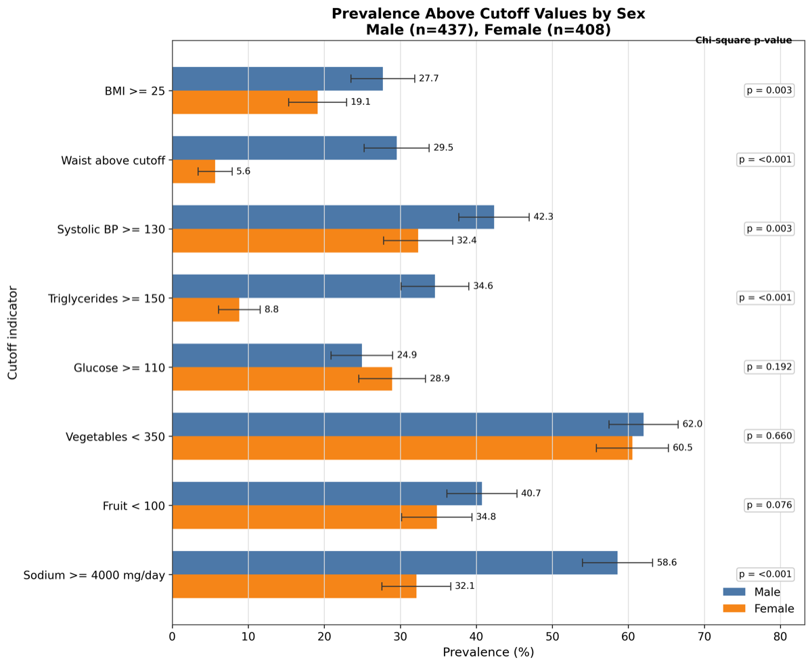
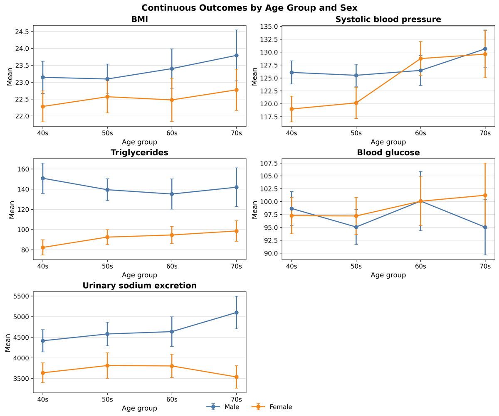

# Public Health Statistics Workflow
*A reproducible public-health analytics portfolio project*

This project demonstrates a reproducible workflow for descriptive public-health statistics, crude group comparisons, age-adjusted regression, forest plot visualization, exploratory interaction analysis, and Quarto-based reporting. It is built to show how spreadsheet-style public-health data can be turned into a transparent, versioned analysis with cautious interpretation and clear visual presentation.

## Quick Links

- [Live Quarto Report](https://makotoy56.github.io/public-health-statistics-workflow/)
- [Main Analysis Notebook](notebooks/generate_public_health_summary_table.ipynb)
- [Quarto Report Source](reports/public_health_summary_report.qmd)
- [Helper Modules](src/)

## What This Demonstrates

- reproducible descriptive epidemiology workflow
- public-health threshold analysis
- crude and age-adjusted comparisons
- age-adjusted linear and logistic regression
- forest plot visualization
- exploratory sex-by-age interaction analysis
- Quarto reporting and GitHub Pages deployment
- Git and GitHub reproducibility practices

## Dataset Snapshot

- 845 participants total
- 437 Male and 408 Female participants
- four broad age groups
- continuous cardiometabolic, dietary, and urinary sodium measures
- binary public-health cutoff indicators
- local workbook excluded from Git

## Executive Summary

- The analytic sample included 845 participants, with 437 Male and 408 Female participants.
- Age-group composition is shown by sex to provide context for later age-adjusted analyses.
- Crude comparisons showed sex-associated differences across selected cardiometabolic, dietary, and urinary sodium indicators.
- Age-adjusted models provided a sensitivity analysis by accounting for categorical age group.
- Standardized forest plots make continuous outcomes comparable across different measurement scales.
- Exploratory sex-by-age interaction analysis was used as a subgroup-pattern check, not as confirmatory evidence.
- Findings are descriptive and should not be interpreted causally.

## Workflow



## Why This Project Matters

Public-health analyses are often first explored in spreadsheets, but the workflow becomes more defensible when the data preparation, statistical testing, modeling, and reporting are all reproducible. This project shows that transition in a compact form: the notebook documents the analytical steps, the Quarto report packages the results for presentation, and Git keeps the code and report source under version control.

The focus is interpretability rather than prediction. The comparisons are framed as descriptive observations and sensitivity analyses, with uncertainty shown explicitly through confidence intervals and forest plots.

## Representative Results

These curated previews are intentionally tracked in `docs/figures/` for the README. The full-resolution analysis figures remain under ignored output paths and are documented in the notebook and Quarto report.

### Figure 4. Prevalence Above Cutoff Values by Sex



This crude figure compares public-health cutoff prevalence between Male and Female participants on a common percentage scale. It is visually intuitive because it shows threshold-based differences directly, without age adjustment, so it should be read as an unadjusted summary.

### Figure 7. Exploratory Sex-by-Age Interaction



This exploratory figure checks whether sex-associated patterns vary across age groups. It is a secondary subgroup-heterogeneity view, not a primary inferential result, and it should be interpreted cautiously alongside the forest plots.

## Technical Snapshot

| Area | Summary |
| --- | --- |
| Data | Local workbook, excluded from Git |
| Design | Descriptive public-health statistics workflow |
| Primary comparisons | Male vs Female |
| Adjustment | Categorical age group |
| Models | Linear regression and logistic regression |
| Reporting | Jupyter notebook and Quarto HTML report |
| Tools | Python, pandas, scipy, statsmodels, matplotlib, openpyxl, Quarto |

## Statistical Methods

- Descriptive statistics: means, standard deviations, medians, interquartile ranges, and percentages
- Mann-Whitney U tests for crude continuous comparisons
- Chi-square tests for crude categorical and binary comparisons
- Age-adjusted linear regression for continuous outcomes
- Age-adjusted logistic regression for binary cutoff outcomes
- Exploratory sex-by-age interaction models to assess possible subgroup heterogeneity

The Quarto report includes the age-adjusted forest plots for the continuous and binary outcomes. See the report source for the full presentation of those model-based figures.

## Reproducibility

- Raw data are excluded from Git.
- Generated outputs are ignored.
- Curated README preview figures are intentionally tracked under `docs/figures/`.
- The Quarto report is deployed with GitHub Actions to GitHub Pages.
- The notebook remains the main analysis workspace, while the Quarto report is the presentation layer.

## Explore The Project

- [Main notebook](notebooks/generate_public_health_summary_table.ipynb)
- [Quarto report source](reports/public_health_summary_report.qmd)
- [Live report](https://makotoy56.github.io/public-health-statistics-workflow/)
- [Helper modules](src/)

GitHub Pages must be enabled from repository Settings > Pages > Build and deployment > GitHub Actions.

## Project Structure

```text
.
├── .github/
│   └── workflows/
│       └── publish-quarto.yml
├── data/                     # local workbook, ignored
├── docs/
│   └── figures/
├── notebooks/
│   └── generate_public_health_summary_table.ipynb
├── outputs/                  # generated files, ignored
├── reports/
│   └── public_health_summary_report.qmd
├── src/
├── README.md
└── requirements.txt
```

## Notes on Data

Keep the local workbook under `data/` and out of Git. The repository is structured so the analysis can be rerun locally without tracking the underlying raw data or generated outputs.
