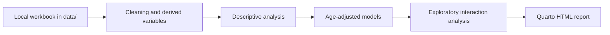

# Public Health Statistics Workflow

Reproducible epidemiology and public-health analytics workflow built around a Jupyter notebook for analysis and a Quarto report for presentation. The project emphasizes descriptive comparisons, age-adjusted sensitivity analysis, and exploratory subgroup checks while keeping raw data and generated outputs out of Git.

## Quick Links

- [Live Quarto Report](https://makotoy56.github.io/public-health-statistics-workflow/)
- [Main Analysis Notebook](notebooks/generate_public_health_summary_table.ipynb)
- [Quarto Report Source](reports/public_health_summary_report.qmd)

## Representative Figures

These curated previews are intentionally tracked in `docs/figures/` for the README. The full-resolution analysis figures remain under ignored output paths.

| Figure 5 | Figure 6 |
| --- | --- |
|  |  |
| Age-adjusted mean differences for continuous outcomes | Age-adjusted odds ratios for binary threshold outcomes |

## Key Features

- Reproducible public-health analytics workflow
- Descriptive epidemiology summary table and crude sex comparisons
- Age-adjusted sensitivity analysis using linear and logistic regression
- Forest plot visualization for adjusted continuous and binary outcomes
- Exploratory sex-by-age interaction analysis
- Quarto HTML reporting layer
- Git-friendly separation of analysis code, report source, and generated artifacts

## Statistical Methods

- Descriptive statistics: means, standard deviations, medians, interquartile ranges, and percentages
- Mann-Whitney U tests for crude continuous comparisons
- Chi-square tests for crude categorical and binary comparisons
- Age-adjusted linear regression for continuous outcomes
- Age-adjusted logistic regression for binary cutoff outcomes
- Exploratory sex-by-age interaction models to assess possible subgroup heterogeneity

All inferential work is framed as descriptive or sensitivity analysis rather than causal inference.

## Reproducibility

- The Jupyter notebook is the main analysis workspace.
- Reusable helper functions live under `src/` for future refactoring.
- `reports/public_health_summary_report.qmd` is the stakeholder-facing Quarto layer.
- Generated outputs live under `outputs/` and are ignored by Git.
- Curated README preview images are stored separately under `docs/figures/`.

## Workflow Overview



## Repository Structure

```text
.
├── data/                     # local workbook, ignored
├── docs/
│   └── figures/
├── notebooks/
│   └── generate_public_health_summary_table.ipynb
├── outputs/                  # generated files, ignored
├── reports/
│   └── public_health_summary_report.qmd
├── src/
├── README.md
└── requirements.txt
```

## Running the Project

Set up the environment:

```bash
python3 -m venv .venv
source .venv/bin/activate
pip install -r requirements.txt
```

Run the notebook workspace:

```bash
.venv/bin/jupyter notebook notebooks/generate_public_health_summary_table.ipynb
```

Render the Quarto report:

```bash
quarto render reports/public_health_summary_report.qmd --output-dir outputs/reports
```

## Reports

- The Quarto report is the polished presentation layer.
- The notebook remains the main analysis workspace.
- Generated HTML is deployed through GitHub Pages using GitHub Actions.

GitHub Pages must be enabled from repository Settings > Pages > Build and deployment > GitHub Actions.

## Generated Outputs

Running the notebook creates a styled Excel summary table, analysis figures, and optional HTML report files under `outputs/`. These files are intentionally ignored by Git because they are reproducible generated artifacts.

The README uses curated preview images stored under `docs/figures/` for portfolio display.

## Notes on Data

Keep the local workbook under `data/` and out of Git. The repository is structured so the analysis can be rerun locally without tracking the underlying raw data or generated outputs.
