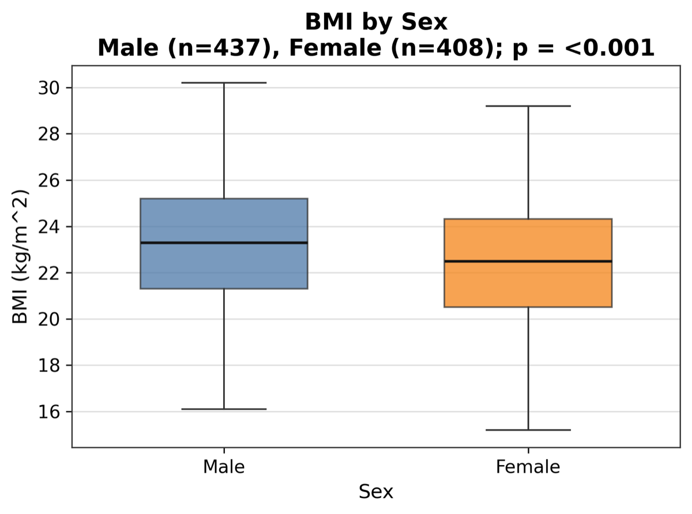
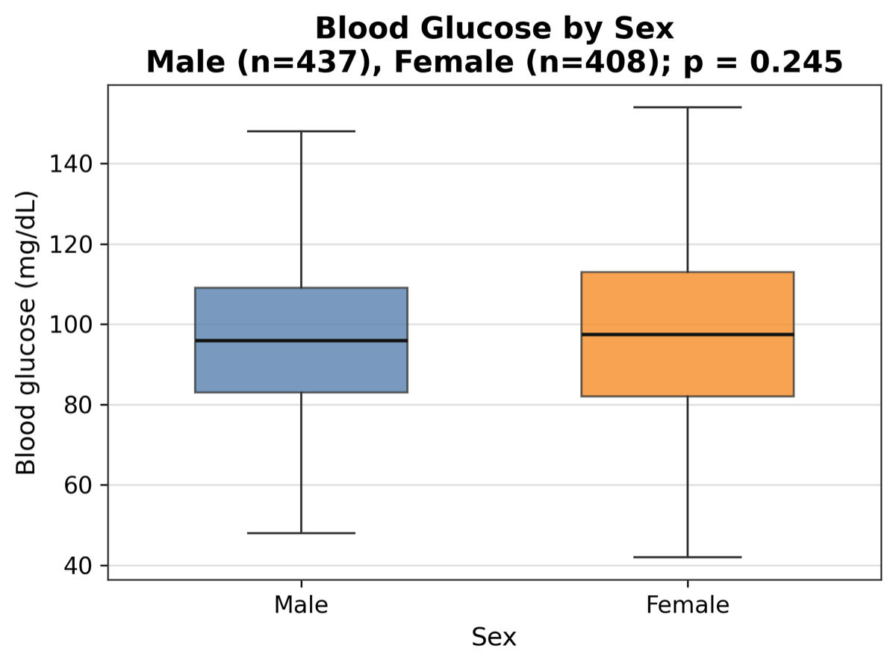
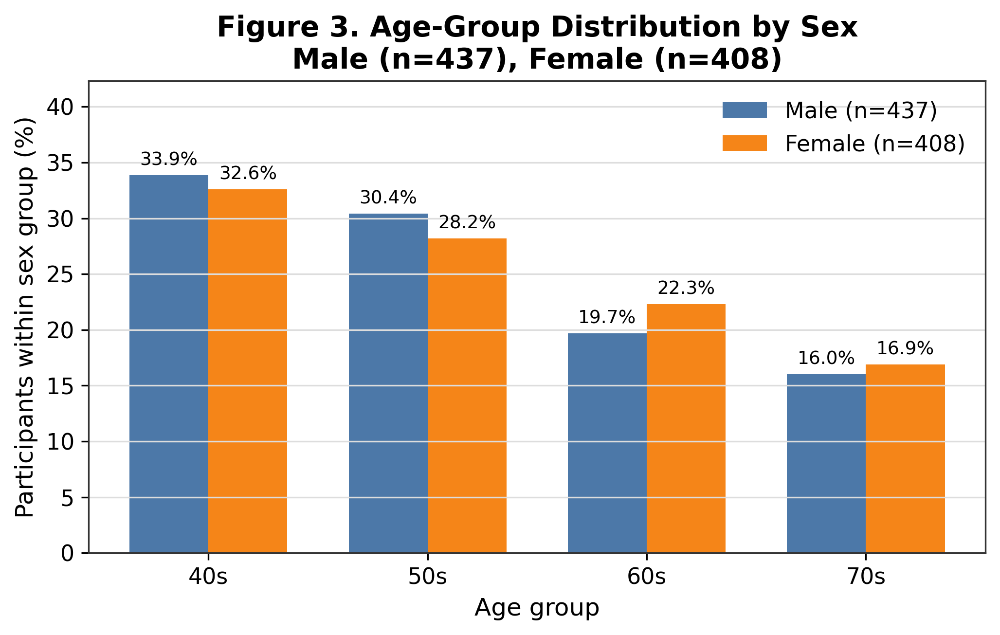
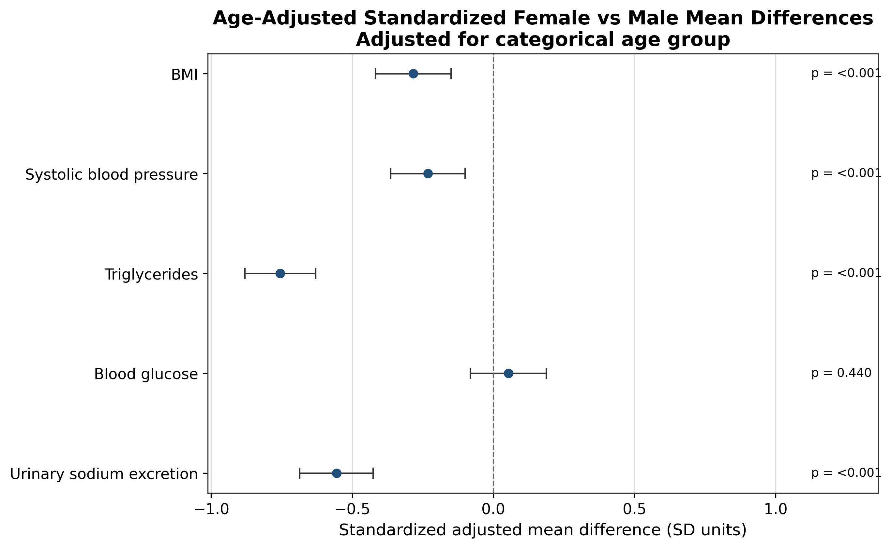
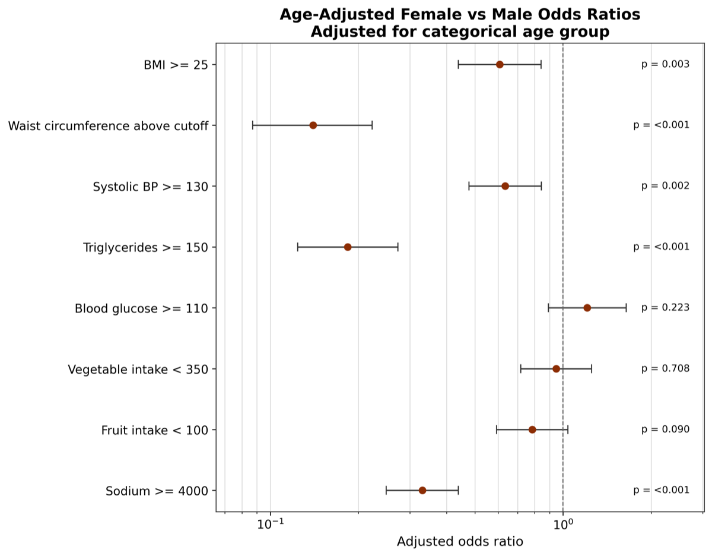

# Overview

This Quarto report is the stakeholder-facing presentation layer for the project. The Jupyter notebook remains the main analysis workspace and continues to produce the summary table, forest plots, and exploratory figures. This report reuses those generated outputs to present the analysis in a cleaner, narrative format.

The workflow is intentionally reproducible and local: generated outputs are written to `outputs/`, while raw data remain outside Git. The report summarizes crude comparisons, age-adjusted sensitivity analyses, and an exploratory sex-by-age interaction check without changing the underlying calculations.

# Analytic Objective

The aim of this analysis is to describe how a small set of public-health measures differs between Male and Female participants, then check whether those differences persist after age-group adjustment. A secondary goal is to explore whether sex differences vary across age groups.

This is an observational descriptive workflow. It is designed to summarize patterns, not to support causal claims.

# Methods

## Sample and variables

The analytic dataset contains 845 participants, with 437 Male and 408 Female participants. Age is grouped into four broad categories spanning the 40s through the 70s. The analysis covers continuous cardiometabolic measures, dietary variables, urinary sodium excretion, and binary cutoff indicators derived from assignment-specific thresholds.

## Crude descriptive analysis

The main summary table reports descriptive statistics by sex and overall. Continuous variables are summarized with means, standard deviations, medians, and interquartile ranges. Binary and categorical variables are summarized with percentages. Mann-Whitney U tests are used for crude continuous comparisons, and chi-square tests are used for crude categorical and binary comparisons.

These crude results are unadjusted. They are useful for describing the data, but they do not account for age-group composition.

## Exploratory visualizations

The crude visualizations use simple matplotlib figures to show distributions by sex, age-group composition, and cutoff prevalence. The goal is to make patterns easier to see without adding unnecessary graphical complexity.

## Age-adjusted sensitivity analysis

The age-adjusted models estimate Female vs Male contrasts after adjusting for categorical age group only. Continuous outcomes are modeled with linear regression, and binary cutoff outcomes are modeled with logistic regression. The resulting forest plots show standardized adjusted mean differences for continuous outcomes and adjusted odds ratios for binary outcomes.

These models are sensitivity analyses. They help assess whether the crude comparisons are materially changed by broad age structure, but they do not make the analysis causal.

## Exploratory interaction analysis

The sex-by-age interaction model evaluates whether Female vs Male differences appear to vary across age groups. This is an exploratory subgroup-heterogeneity check, not a primary inferential endpoint. Figure 7 provides the main visual summary of that pattern.

# Descriptive Summary

The summary table gives the baseline descriptive picture of the sample. In broad terms, the dataset is balanced enough by sex to support a direct comparison, and the age distribution is spread across the four age bands rather than concentrated in a single group.

The continuous measures show meaningful within-group variability, which is why the median and interquartile range are reported alongside the mean and standard deviation. The binary cutoff indicators help translate the same data into public-health-oriented thresholds that are easier to compare across outcomes.

The key interpretive point is that the summary table is descriptive. It is designed to orient the reader before moving into the crude figures and the adjusted analyses that follow.

# Crude Visualizations

**Figure 1. BMI by Sex**

{fig-cap="Figure 1. BMI by Sex. Crude boxplots compare the unadjusted distributions for Male and Female participants." fig-alt="Boxplot of BMI by sex."}

BMI distributions overlap substantially, which suggests that the crude sex contrast is modest relative to the within-group spread. The p-value in the notebook is only a reference for the unadjusted comparison; the figure itself is more informative about magnitude and overlap than about practical importance.

**Figure 2. Blood Glucose by Sex**

{fig-cap="Figure 2. Blood Glucose by Sex. Crude boxplots compare the unadjusted distributions for Male and Female participants." fig-alt="Boxplot of blood glucose by sex."}

Blood glucose also shows overlap between groups, with the boxplots emphasizing the spread and central tendency rather than a single significance threshold. This is a descriptive comparison, so the more useful question is whether the distributions are meaningfully separated rather than whether a p-value crosses an arbitrary cutoff.

**Figure 3. Age-Group Distribution by Sex**

{fig-cap="Figure 3. Age-Group Distribution by Sex. Bars show age-group percentages calculated separately within Male and Female participants." fig-alt="Grouped bar chart of age-group distribution by sex."}

This figure shows the age composition separately for Male and Female participants. It provides context for the later age-adjusted sensitivity analysis because crude sex comparisons may partly reflect age-group composition if the two groups have different age distributions.

**Figure 4. Prevalence Above Cutoff Values by Sex**

{fig-cap="Figure 4. Prevalence Above Cutoff Values by Sex. Bars show crude Male and Female prevalences with approximate 95% confidence intervals." fig-alt="Horizontal grouped bar chart of cutoff prevalence by sex."}

This figure is the clearest crude summary of the threshold outcomes because it places all binary indicators on the same percentage scale. It complements the continuous boxplots by showing how the same measures behave when translated into public-health cutoffs. The error bars are approximate and should be read as uncertainty bands rather than as formal hypothesis tests.

# Age-Adjusted Sensitivity Analysis

The crude figures are informative, but they do not account for broad age-group differences. The next step is to adjust the sex comparisons for categorical age group only and check whether the main patterns persist.

## Forest Plots

**Figure 5. Age-Adjusted Standardized Mean Differences**

{fig-cap="Figure 5. Age-Adjusted Standardized Mean Differences. Estimates come from linear regression models adjusted for categorical age group only and are shown in standard-deviation units." fig-alt="Forest plot of age-adjusted standardized mean differences."}

Figure 5 shows standardized adjusted mean differences for the continuous outcomes. The outcomes are standardized because their original units and ranges differ, so the estimates are interpreted in standard-deviation units. This makes the cross-outcome visual comparison more meaningful than plotting BMI, blood pressure, glucose, and urinary sodium on one raw-unit axis. Confidence intervals and p-values describe model-based uncertainty, but p-values should not be read as practical importance by themselves.

**Figure 6. Age-Adjusted Odds Ratios**

{fig-cap="Figure 6. Age-Adjusted Odds Ratios. Estimates come from logistic regression models adjusted for categorical age group only." fig-alt="Forest plot of age-adjusted odds ratios."}

Figure 6 translates the same sex comparison into a prevalence-oriented form for the binary outcomes. Odds ratios are useful here because they align directly with the cutoff definitions and make it easier to see which public-health thresholds show persistence versus attenuation after age adjustment. As with Figure 5, uncertainty matters: confidence intervals describe how stable the adjusted contrast appears, not whether the effect is practically large.

# Exploratory Sex-by-Age Interaction Analysis

The interaction model asks a narrower exploratory question: do the Female vs Male contrasts look similar across age groups, or do they vary by age stratum? This is useful for subgroup-heterogeneity assessment, but it should not be overinterpreted.

**Figure 7. Exploratory Sex-by-Age Interaction**

{fig-cap="Figure 7. Exploratory Sex-by-Age Interaction. This exploratory figure shows whether mean levels appear to vary differently by sex across age groups." fig-alt="Interaction line plots for continuous outcomes."}

This figure is the main interaction visualization because it summarizes how the continuous outcomes behave across both sex and age groups in one place. Roughly parallel lines suggest little evidence of subgroup heterogeneity, while visibly diverging or crossing lines suggest possible effect modification. Because subgroup estimates can be unstable, this should be treated as a screening view rather than a definitive interaction result.

# Results

The overall picture is consistent with a descriptive public-health report: the crude table and figures describe the observed sex differences, the age-adjusted models show which contrasts remain after accounting for age-group composition, and the interaction figure checks whether the sex contrast appears consistent across age strata.

Taken together, the crude and adjusted results suggest that some differences are robust enough to remain visible after age adjustment, while others attenuate or become less certain once age is accounted for. The binary cutoff figure is especially helpful for seeing which public-health thresholds may differ between groups even when the continuous boxplots look more similar.

The age-adjusted forest plots are the clearest summary of the adjusted analysis. They provide a compact view of direction, magnitude, and uncertainty, and they make it easier to compare continuous and binary outcomes side by side. The interaction analysis is more tentative: its value is in highlighting potential heterogeneity, not in producing a standalone conclusion.

# Discussion

This analysis is best read as a descriptive public-health summary rather than a causal model. The crude comparisons are useful for orientation, but they can be influenced by age-group composition. The age-adjusted models address that specific limitation by estimating sex contrasts after controlling for categorical age group only.

The contrast between Figure 5 and Figure 6 is conceptually important. Figure 5 uses continuous outcomes and asks how much the mean level differs after adjustment, whereas Figure 6 uses binary cutoffs and asks how the odds of crossing a public-health threshold differ after adjustment. Those two views are complementary, not redundant: a small adjusted mean difference can coexist with a more visible threshold difference, or vice versa.

The interaction analysis is exploratory and should be treated as a secondary check on subgroup heterogeneity. If the sex patterns look similar across age groups, that supports a simpler overall interpretation. If they vary by age, that is a useful signal for future work, but not a reason to overstate subgroup claims in this descriptive dataset.

# Limitations

- Age is the only adjustment variable currently included in the sensitivity analysis.
- Small subgroup counts can make some regression estimates unstable, especially in logistic models.
- The workflow is educational and exploratory rather than a full analytic plan for causal inference.
- The analysis depends on the local data file and the assignment-specific cutoff definitions used to derive binary indicators.

# Future Directions

- Multivariable regression with additional covariates.
- Interaction analyses with more formal subgroup comparisons.
- Automated Quarto reporting directly from reusable modules.
- Expanded plotting and statistics helpers under `src/`.
- Adaptation to other clinical or epidemiologic datasets with documented variable definitions.
